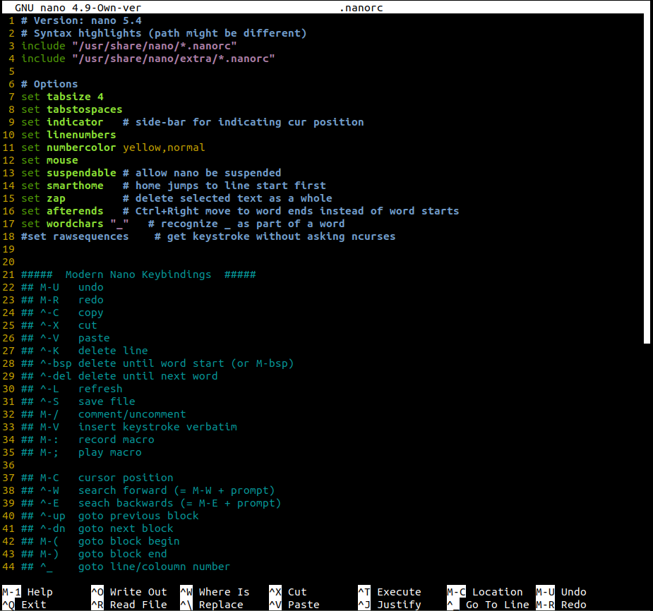

# Modern Nano Keybindings
[](https://github.com/davidhcefx/Modern-Nano-Keybindings/actions/workflows/test.yml)

## Features

- Common _mainstream_ keybindings.
    + `Ctrl+C`: copy
    + `Ctrl+Z`: suspend
    + `Ctrl+Q`: quit
- Vim-like support.
    + `Ctrl+F`: page-down
    + `Ctrl+G`: head-of-file
    + `Alt+G`: end-of-file
- and at the same time preserve ***all*** functionalities!
    + (many rcfiles override keys and don't assign new ones for them)

## Install

1. This rcfile is for nano version 2.9. For latest version, see [master branch].
    - Take a look at [releases](https://github.com/davidhcefx/Modern-Nano-Keybindings/releases) if you are using a legacy version.
2. Copy the following contents into `~/.nanorc`:

```nanorc
# Version: nano 2.9
# Syntax highlights (path might be different)
include "/usr/share/nano/*.nanorc"
include "/usr/share/nano/extra/*.nanorc"

# Options
set tabsize 4
set tabstospaces
set linenumbers
set numbercolor yellow
set mouse       # enable mouse support
set suspend     # allow nano be suspended
set smarthome   # `Home` jumps to line start first
set wordchars "_"   # recognize '_' as part of a word
set historylog      # remember search history
# 2.9 additional
set smooth
set morespace


#####  Modern Nano Keybindings  #####
## M-U   undo
## M-R   redo
## ^-C   copy
## ^-X   cut
## ^-V   paste
## ^-K   delete line
## ^-bsp delete until word start (or M-bsp)
## M-d   delete until next word
## ^-L   refresh and center cursor
## ^-S   save file
## M-/   comment/uncomment
## M-V   insert keystroke verbatim
## M-:   record macro
## M-;   play macro

## M-C   cursor position
## ^-W   search forward (= M-W + prompt)
## ^-E   seach backwards (= M-E + prompt)
## ^-R   replace
## ^-up  goto previous block
## ^-dn  goto next block
## M-(   goto block begin
## M-)   goto block end
## ^_    goto line/coloumn number
## ^-G   head of file (vim-like)
## M-G   end of file
## M--   screen up one line
## M-+   screen down one line
## M-]   goto matching bracket

unbind ^Y  main  # remove unused bindings
unbind ^A  main
unbind M-Q all

bind M-R  redo          main
bind ^C   copytext      main
bind ^X   cut           main
bind ^V   uncut         main
bind ^H   cutwordleft   all
bind M-d  cutwordright  all
bind ^Q   exit          all
bind M-/  comment       main

bind M-C  curpos        main
bind ^E   wherewas      all
bind M-E  findprevious  all
bind ^R   replace       all
bind ^B   pageup        all  # vim-like support
bind ^F   pagedown      all
bind ^G   firstline     all
bind M-G  lastline      all
bind M-1  help          all  # fix ^G been used
bind F3   constupdate   main  # fix M-C been used
# 2.9 additional
bind F12  speller       main
bind M-B  linter        main
bind ^W   whereis       main
bind M-W  findnext      main
bind M-D  wordcount     main
bind M-S  softwrap      main
bind M-O tabstospaces   main
```

> - If the path to **syntax highlighting files** are different on your system, please modify those `includes` around `line 3`.  
> - For more colorful syntax highlightings, see: [scopatz/nanorc](https://github.com/scopatz/nanorc).

## Screenshot


