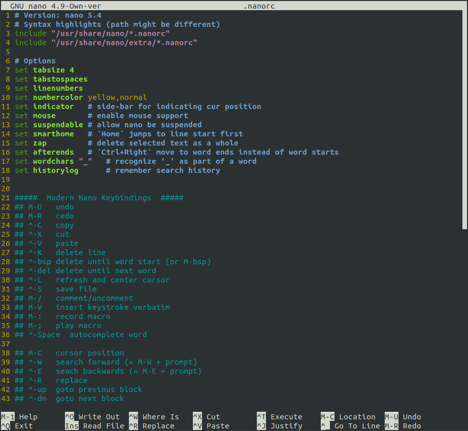

# Modern Nano Keybindings

[](https://github.com/davidhcefx/Modern-Nano-Keybindings/actions/workflows/test.yml)

## Features

- Common _mainstream_ keybindings.
    + `Ctrl+C`: copy
    + `Ctrl+Z`: suspend
    + `Ctrl+Q`: quit
- Vim-like support.
    + `Ctrl+F`: page-down
    + `Ctrl+G`: head-of-file
    + `Alt+G`: end-of-file
- ...and at the same time preserve ***all*** functionalities!
    + (many rcfiles overrode keys and didn't assign new ones for them)

## Install

1. Make sure you are running the [latest nano](https://www.nano-editor.org/).
    - If you are using a legacy version, please take a look at [other branches](https://github.com/davidhcefx/Modern-Nano-Keybindings/branches)!
2. Copy the following contents into `~/.nanorc`:

```nanorc
# Modern Nano Keybindings
# For: nano 7.2
# Syntax highlights (path might be different)
include "/usr/share/nano/*.nanorc"
include "/usr/share/nano/extra/*.nanorc"

# Options
set tabsize 4
set tabstospaces
set linenumbers
set numbercolor yellow,normal
set scrollercolor grey,normal
set indicator       # side bar for indicating cur position
set smarthome       # `Home` jumps to line start first
set afterends       # `Ctrl+Right` move to word ends instead of word starts
set wordchars "_"   # recognize '_' as part of a word
set zap             # delete selected text as a whole
set atblanks        # soft wrap at blank chars
set historylog      # remember search history
set multibuffer     # read files into multibuffer instead of insert
set mouse           # enable mouse support
#set locking         # vim-like file locks
#set nohelp          # disable help when you are familiar enough


#####  Keybindings Cheatsheet  #####
## ^-Q   quit
## M-U   undo
## M-R   redo
## ^-C   copy
## ^-V   paste
## ^-X   cut
## ^-K   delete line
## ^-Bsp delete until word start (or M-Bsp)
## ^-Del delete until next word
## ^-S   save file
## M-/   comment/uncomment
## M-:   record macro
## M-;   play macro
## ^-Space autocomplete word
## ^-T     terminal (eg. "|xxd")

## M-C   show cursor position
## ^-L   refresh and center at cursor
## ^-W   search forwards (= M-W with prompt)
## ^-E   search backwards (= M-E with prompt)
## ^-R   replace
## ^_    goto line number
## ^-Up  goto previous block
## ^-Dwn goto next block
## M-]   goto matching bracket
## ^-G   goto head of file (vim-like)
## M-G   goto end of file
## M-Up  scroll screen up
## M-Dwn scroll screen down
## M-Left  switch to previous file
## M-Rght  switch to next file
## M-Ins   insert anchor
## M-PgDwn goto next anchor

bind ^Q   exit          all
bind ^Z   suspend       main
bind M-R  redo          main
bind ^C   copy          main
bind ^V   paste         main
bind ^X   cut           main
bind ^K   zap           main
bind ^H   chopwordleft  all
bind M-/  comment       main
bind ^Space complete    main

bind M-C  location      main
bind ^E   wherewas      all
bind M-E  findprevious  all
bind ^R   replace       main
bind ^_   gotoline      main
bind ^G   firstline     all
bind M-G  lastline      all
bind ^B   pageup        all  # vim-like support
bind ^F   pagedown      all  # vim-like support

## for macOS
#bind M-F  nextword      all  # is M-left on iTerm natural editing
#bind M-B  prevword      all
#bind M-2  anchor        main # M-Ins keystroke is hard to produce
#bind F2   nextanchor    main
#bind F3   prevanchor    main

bind M-1    help         all   # fix ^G been used
bind Sh-M-C constantshow main  # fix M-C been used
bind Sh-M-F formatter    main  # fix M-F and M-B might be used
bind Sh-M-B linter       main
#unbind ^J               main  # for those who rarely use justify
#unbind M-J              main  # for those who rarely use justify
```

> - If the path to **syntax highlighting files** are different on your system, please modify those `includes` around `line 3`.
> - For more colorful syntax highlightings, see: [galenguyer/nano-syntax-highlighting](https://github.com/galenguyer/nano-syntax-highlighting) :-)

## Screenshot


